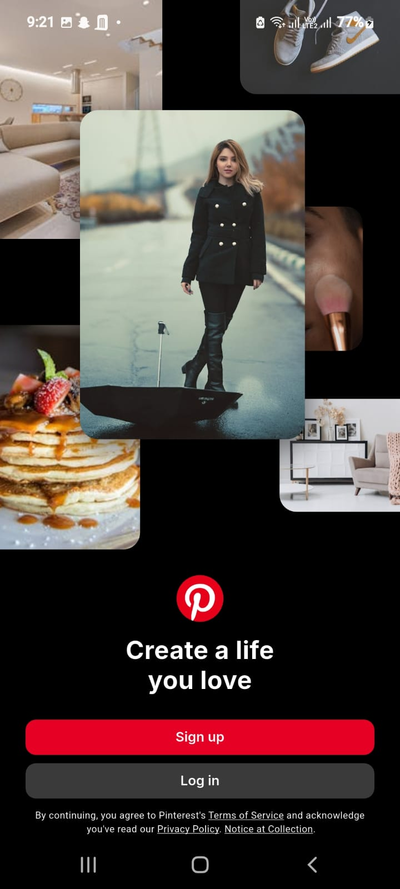
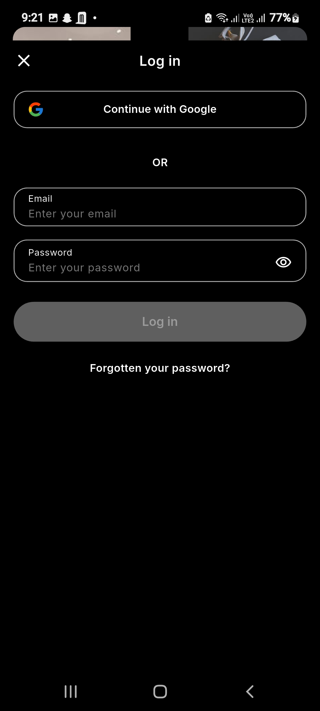
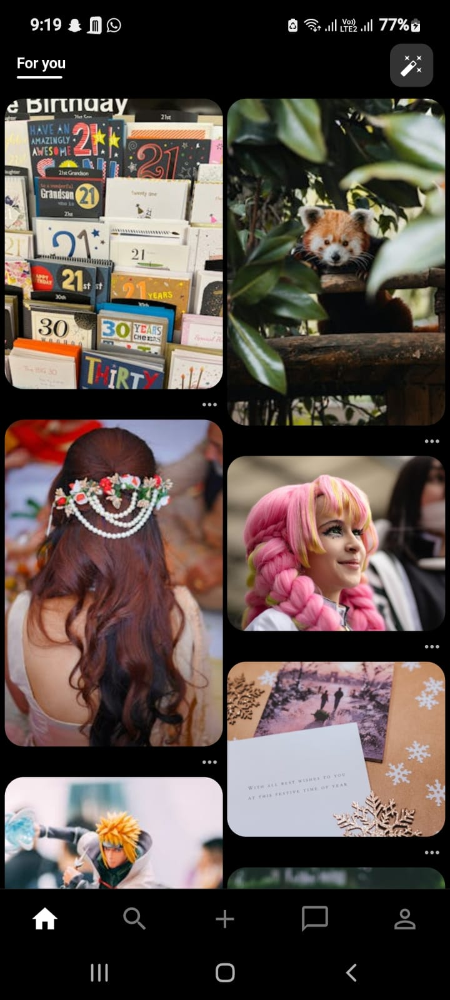
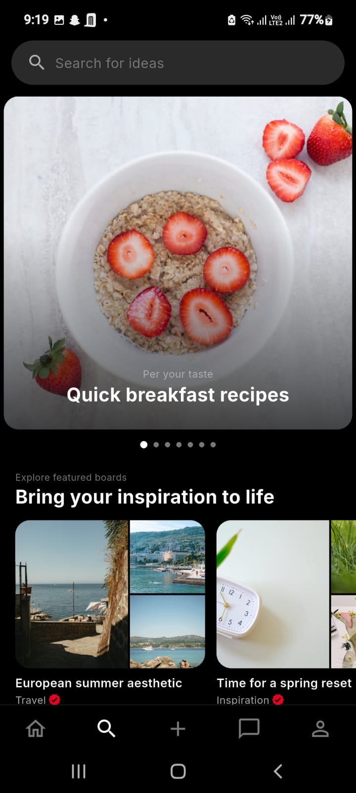
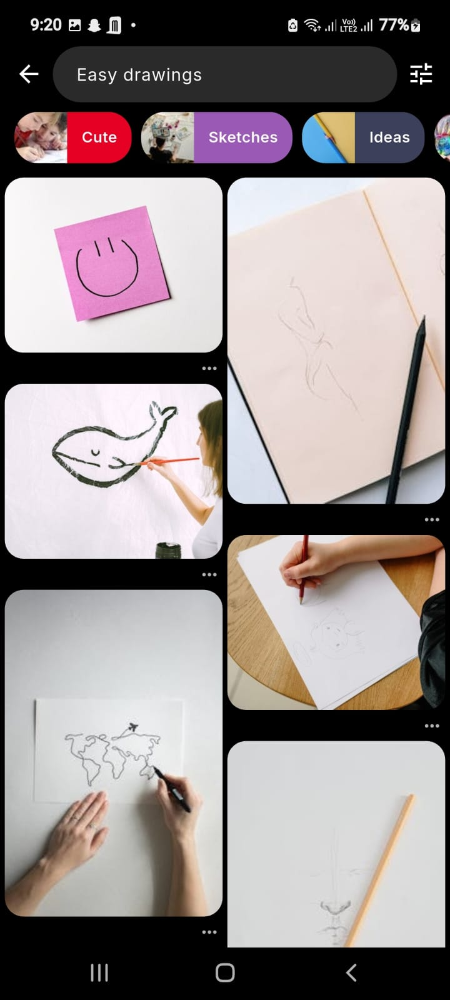
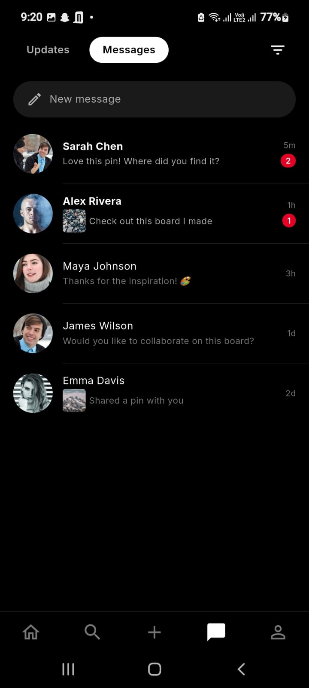
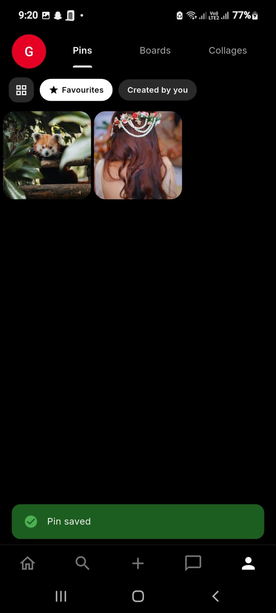
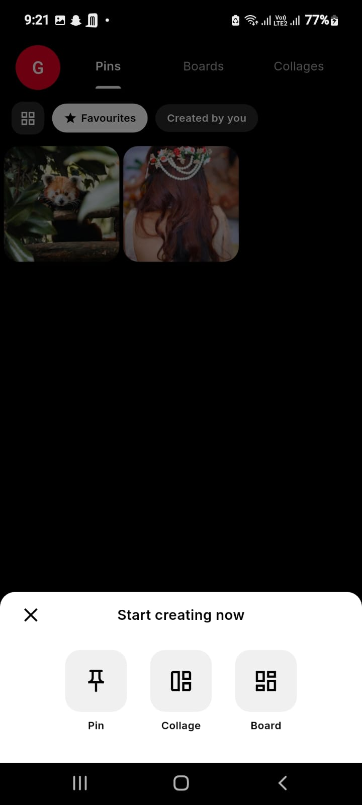
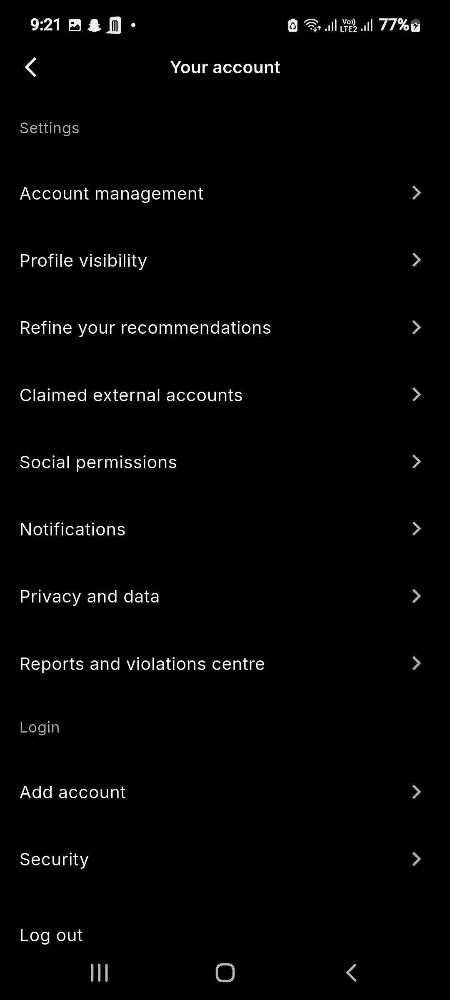
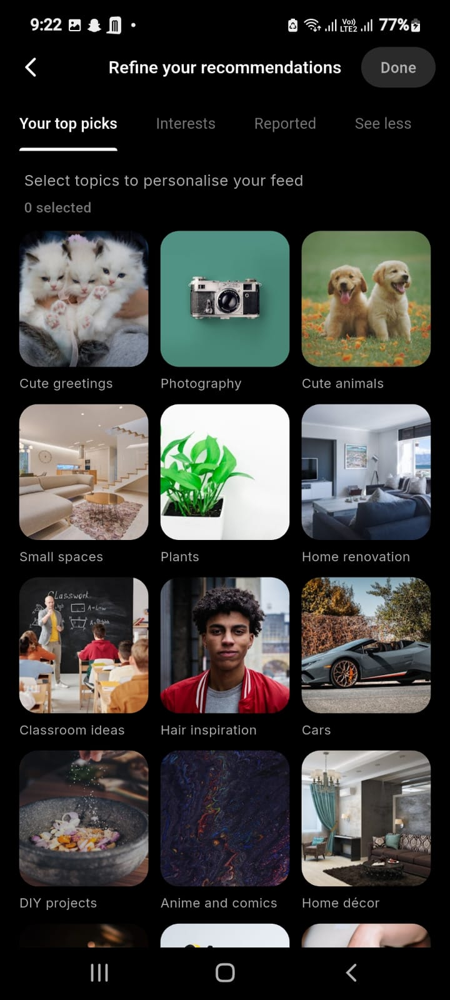

# Pinterest Clone

A **pixel-perfect Pinterest clone** built with Flutter, replicating the official Pinterest mobile app — screens, animations, transitions, and micro-interactions.

## Screenshots

### Authentication Flow

| Welcome Screen | Login Screen |
|:-:|:-:|
|  |  |

**Welcome Screen** — Animated photo collage background with the Pinterest logo, red "Sign up" CTA, and gray "Log in" button. Terms of Service and Privacy Policy links at the bottom.

**Login Screen** — "Continue with Google" SSO button at the top, followed by an "OR" divider, email/password fields with visibility toggle, "Log in" button, and "Forgotten your password?" link.

---

### Home Feed

| Home Feed — "For you" Tab |
|:-:|
|  |

**Home Feed** — 2-column masonry grid layout with variable-height pin cards (16px rounded corners). The "For you" tab shows personalized content. Each pin card has a `···` options menu. A tune/filter icon sits in the top-right corner. Bottom navigation bar: Home (active), Search, Create (+), Messages, Profile.

---

### Search & Explore

| Search / Explore | Search Results |
|:-:|:-:|
|  |  |

**Search / Explore** — "Search for ideas" search bar at top. Below it, a full-width "Per your taste" recommendation carousel with pagination dots. "Explore featured boards" section with horizontally scrollable board cards showing category labels (e.g., "European summer aesthetic — Travel").

**Search Results** — Back arrow + search input with the query. Horizontal scrollable category chips with thumbnail previews (Cute, Sketches, Ideas). Filter icon on the right. Results displayed in the standard 2-column masonry grid with `···` options on each pin.

---

### Messages

| Messages Screen |
|:-:|
|  |

**Messages** — Tab bar with "Updates" and "Messages" (active, pill-shaped). Filter icon on the right. "New message" compose bar at top. Conversation list with circular avatars, sender name, message preview, timestamp, and red unread count badges. Divider lines between conversations.

---

### Profile

| Profile — Saved Pins | Create Bottom Sheet |
|:-:|:-:|
|  |  |

**Profile — Saved Pins** — Red circular avatar with initial letter at top-left. Tabs: Pins (active, underlined), Boards, Collages. Filter chips: grid-view icon, "Favourites" (star), "Created by you". Saved pins displayed in a compact grid. Green "Pin saved" toast/snackbar at the bottom.

**Create Bottom Sheet** — Modal bottom sheet triggered from the "+" button. Title: "Start creating now". Three options with icons: Pin, Collage, Board. Dismissible via the "✕" button.

---

### Settings & Preferences

| Account Settings | Refine Recommendations |
|:-:|:-:|
|  |  |

**Account Settings** — Full-screen list view with back arrow and "Your account" title. Sections: Settings (Account management, Profile visibility, Refine your recommendations, Claimed external accounts, Social permissions, Notifications, Privacy and data, Reports and violations centre) and Login (Add account, Security, Log out). Each row has a right-chevron indicator.

**Refine Recommendations** — Back arrow, title, "Done" button. Tab bar: Your top picks (active, underlined), Interests, Reported, See less. Subheading: "Select topics to personalise your feed" with selected count. 3-column grid of topic cards with thumbnail images and labels (Cute greetings, Photography, Cute animals, Small spaces, Plants, Home renovation, etc.). Green highlight border on selected topics.

---

### UI Reference Summary (for Developers)

| Element | Specification |
|---|---|
| **Theme** | Dark — black `#000000` background, dark gray `#1A1A1A` surfaces |
| **Accent Color** | Pinterest Red `#E60023` (CTAs, badges, active indicators) |
| **Grid Layout** | 2-column masonry (`MasonryGridView.count`), ~4px gap |
| **Card Corners** | 16px (`BorderRadius.circular(16.r)`) |
| **Bottom Nav** | 5 items: Home, Search, Create (+), Messages, Profile |
| **Bottom Nav Style** | Icon-only, no labels, active = filled, inactive = outlined |
| **Search Bar** | Rounded pill shape, gray background, search icon left |
| **Chips/Filters** | Rounded pill, dark gray bg, white text, horizontal scroll |
| **Avatars** | Circular, 48px for conversation list, 40px for profile |
| **Toast/Snackbar** | Green background, white text, checkmark icon, bottom-positioned |
| **Bottom Sheet** | White background, rounded top corners, 3-column icon grid |
| **Settings Rows** | Full-width, title left, chevron right, divider between rows |
| **Tab Indicators** | White text, underline on active tab |
| **Unread Badges** | Red circle with white count text |
| **Typography** | Bold for names/titles, regular for descriptions, gray for timestamps |
| **Animations** | Hero transitions (pin tap → detail), shimmer loading, collage animation on welcome |

## Tech Stack

| Category | Package |
|---|---|
| **Framework** | Flutter (SDK ^3.11.0) |
| **State Management** | `flutter_riverpod` |
| **Navigation** | `go_router` |
| **Networking** | `dio` |
| **Authentication** | `clerk_flutter` (Clerk) |
| **Image Caching** | `cached_network_image` |
| **Loading Effects** | `shimmer` |
| **Grid Layout** | `flutter_staggered_grid_view` |
| **Responsiveness** | `flutter_screenutil` |
| **Serialization** | `freezed` + `json_serializable` |
| **Functional** | `dartz` (Either type) |
| **Local Storage** | `shared_preferences` + `flutter_secure_storage` |
| **Environment** | `flutter_dotenv` |

## Architecture

Clean Architecture with strict layer separation:

```
lib/
├── config/              # App config, environment, remote config
├── core/                # Shared utilities, services, design system, DI
│   ├── base/            # Base classes (UseCase, Failure, State)
│   ├── constants/       # API, asset, storage key constants
│   ├── design_systems/  # Colors, typography, spacing, borders, shadows
│   ├── di/              # Dependency injection
│   ├── extensions/      # BuildContext, String, num extensions
│   ├── services/        # API client, storage
│   ├── theme/           # App theme (dark/light)
│   ├── ui/              # Reusable atoms/molecules/organisms
│   └── utils/           # Logger, validators, formatters
├── features/            # Feature modules
│   ├── auth/            # Authentication (Clerk), signup, login, forgot password
│   ├── home/            # Home feed (curated + "For You" topic-based)
│   ├── search/          # Photo search
│   ├── create/          # Pin creation
│   ├── messages/        # Messages
│   ├── pin_detail/      # Pin detail view
│   ├── profile/         # User profile
│   └── localization/    # Multi-language support (en, hi, te)
├── router/              # GoRouter setup, route guards
└── main.dart            # Entry point
```

Each feature follows:
```
feature/
├── data/           # Datasources, models, repository implementations
├── domain/         # Entities, repository contracts, use cases
├── presentation/   # Providers (Riverpod), views, widgets
└── docs/           # Feature documentation
```

## Features

- **Authentication** — Email/password signup & login via Clerk, Google SSO, guest mode
- **7-Step Signup** — Email → Password → Email Verification → Birthday → Gender → Country → Topics → Confirmation
- **Email Existence Check** — Real-time Clerk check at email step, redirects to login if registered
- **Forgot Password** — Reset code via email, set new password
- **Home Feed** — 2-column masonry grid, "All" (curated) + "For You" (topic-based) tabs
- **Pin Detail** — Full-screen view with Hero animation, related pins
- **Search** — Photo search via Pexels API
- **Profile** — User info from Clerk API with local storage fallback
- **Shimmer Loading** — Loading placeholders on all async content
- **Localization** — English, Hindi, Telugu
- **Dark Theme** — Pinterest-style dark UI

## API

Uses the [Pexels API](https://www.pexels.com/api/) for photo content:
- `GET /v1/curated` — Curated photos for home feed
- `GET /v1/search` — Search + "For You" topic-based feed
- `GET /v1/photos/:id` — Single photo detail

## Setup

### Prerequisites

- Flutter SDK ^3.11.0
- Dart SDK ^3.11.0
- A [Pexels API key](https://www.pexels.com/api/)
- A [Clerk](https://clerk.com/) publishable key

### Installation

```bash
# Clone the repository
git clone https://github.com/your-username/pinterest.git
cd pinterest

# Install dependencies
flutter pub get

# Create .env file from example
cp .env.example .env
# Add your API keys to .env:
#   PEXELS_API_KEY=your_pexels_key
#   CLERK_PUBLISHABLE_KEY=your_clerk_key

# Generate freezed/json_serializable code
dart run build_runner build --delete-conflicting-outputs

# Run the app
flutter run
```

### Available Commands

```bash
flutter pub get                                            # Install dependencies
dart run build_runner build --delete-conflicting-outputs   # Code generation
dart run build_runner watch --delete-conflicting-outputs   # Watch mode
flutter analyze                                            # Static analysis
flutter test                                               # Run tests
flutter run                                                # Run app
```

## Design System

All UI values use design tokens — no hardcoded colors, spacing, or pixel values:

| Token | Location |
|---|---|
| Colors | `core/design_systems/colors/` |
| Typography | `core/design_systems/typography/` |
| Spacing | `core/design_systems/spacing/` |
| Borders | `core/design_systems/borders/` |
| Shadows | `core/design_systems/shadows/` |
| Dimensions | `core/design_systems/dimensions/` |

Responsive values use `flutter_screenutil`: `.w`, `.h`, `.sp`, `.r`

## Project Conventions

- **Imports** — Always `package:pinterest/...` (no relative imports)
- **State** — Riverpod (`AsyncNotifier`, `FutureProvider`, `NotifierProvider`)
- **Errors** — `Either<Failure, T>` from dartz in repositories
- **Logging** — `AppLogger.info()` / `.error()` / `.debug()` (no `print()`)
- **Storage** — `AppStorage` provider only (no direct SharedPreferences)
- **Navigation** — `RouteNames` / `RoutePaths` constants with GoRouter
- **Widgets** — `ConsumerWidget` / `ConsumerStatefulWidget`, `const` constructors

## License

This project is for educational purposes only. Pinterest is a trademark of Pinterest, Inc.
